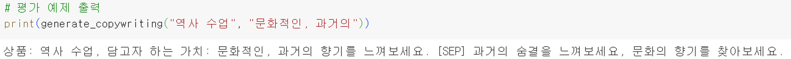

# SLM Copywriter

## Introduction

With **Small Language Models (SLMs)** gaining attention over Large Language Models (LLMs), we assumed that building a **high-quality dataset** would be key to unlocking better SLM performance. In this project, we focused on creating a custom dataset and implementing a high-performing SLM specifically for **copywriting tasks** by leveraging existing LLM capabilities.

Since the dataset will be generated using an existing LLM, we decided to implement a copywriting generation model that meets the following three conditions:
1. **Tasks that existing LLMs excel at**
2. **Generation tasks that require short output lengths, avoiding excessive token counts**
3. **Tasks that address challenging aspects, such as creativity, where traditional SLMs have limitations**

## Methods
### 🗂️ Dataset Generation
To build a **high-quality dataset**, we prioritized three main factors:
1. **Data Quantity**
2. **Data Quality**
3. **Data Diversity**

For **data quality**, we used the **xionic-ko-llama-3-70b API** from Xionic, based on Llama3, as a cost-effective alternative to GPT-4 API.
Additionally, by **collecting real, high-quality copywriting samples** and integrating them into prompts as examples, we significantly elevated the quality of our generated copy.

For **data diversity**, we worked to increase the **variety and relevance of product-value pairs** provided during copy generation. We also ensured that real copywriting examples in the prompts were randomly selected from a curated list to add variety.
- **Dataset Summary**: Generated 11,445 initial pieces of copywriting, filtered down to **10,478 high-quality product-value pairs and copywriting** entries.
  
After curating the dataset, we **fine-tuned multiple language models**, including both SLMs and a BERT-based model for comparison.

### 🧪 Evaluation Metrics
To evaluate our model's output, we used the following three metrics and conducted assessments via **DeepEval** with the GPT-4o API:

- **PV Metric**: Evaluates how well the **product (P)** and **core value (V)** are represented in the copywriting.
- **Naturalness Metric**: Assesses whether the copywriting is **grammatically correct and semantically natural**.
- **Creativity Metric**: Judges the **creativity** of the copywriting.

## Usage

This project centers on the generated dataset, which can be used to fine-tune various models for similar copywriting tasks.

For reference, we’ve uploaded a PEFT fine-tuning checkpoint for the Llama2-based model "42dot/42dot_LLM-SFT-1.3B" on Hugging Face.

➡️ https://huggingface.co/jha999/1.3B_42dot

## Example Output

Sample generated by the **42dot/42dot_LLM-SFT-1.3B** model for a product-value pair:
- Product: History Lesson
- Value: Cultural and Nostalgic

## Team Members

- [Junha Park](https://github.com/joon999): Overall pipeline design, model training
- [Hyunkyoo Kang](): Evaluation metrics design, copywriting generation, model training
- [Yeonwoo Seo](https://github.com/readygetset): Product-value pair creation, evaluation data preparation, model training
- [Minjae Lee](): Product-value pair creation, evaluation data preparation, model training
